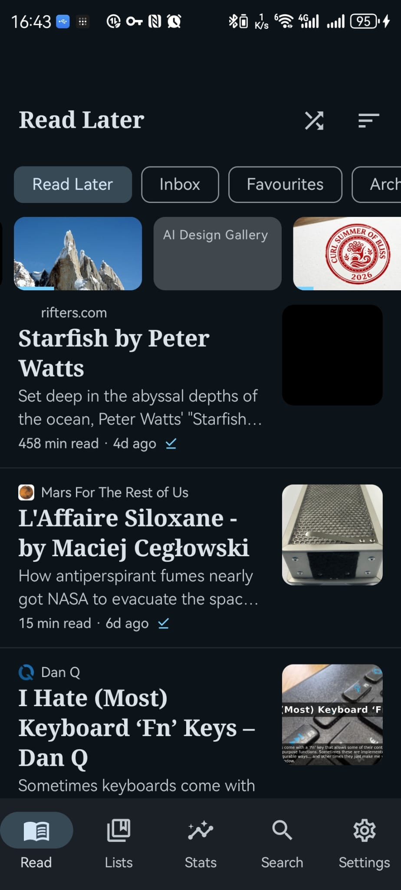
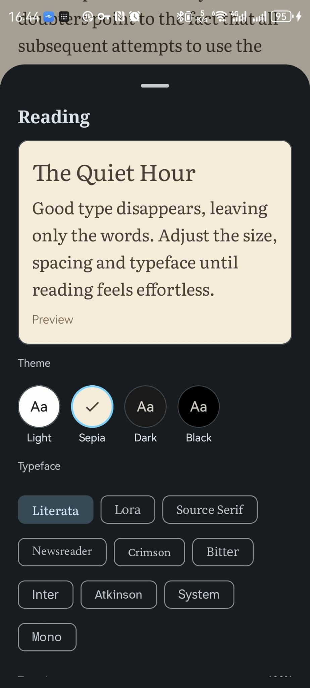

> [!IMPORTANT]  
> Kararead is an independent, unofficial client and is not affiliated with the Karakeep project in any way.

# 📖 Kararead

**An Instapaper-style reader for your [Karakeep](https://karakeep.app) library.**

&nbsp;&nbsp;&nbsp;&nbsp;&nbsp;&nbsp;&nbsp;&nbsp;

&nbsp;&nbsp;&nbsp;&nbsp;&nbsp;&nbsp;&nbsp;&nbsp;

> [!IMPORTANT]  
> LLM Disclosure: Kararead was built with substantial help from large language models, with agent guidance kept in [`AGENTS.md`](AGENTS.md)

---

## Why?

[Karakeep](https://karakeep.app) (formerly Hoarder) is a wonderful self-hosted
bookmark-everything app, and its official app is a great **manager**. But when you
just want to **read** the articles you saved for a calm moment, a dedicated
reader — like Instapaper or Pocket — is a nicer place to be.

Kararead is that reader. It talks to your existing Karakeep server and turns your
"read it later" pile into a focused, beautiful reading experience.

## Getting started

You need a running **Karakeep** server and an **API key**:

1. In Karakeep, go to **Settings → API Keys** and create a key (looks like
   `ak1_…`).
2. Install Kararead (build it yourself, or grab an APK from
   [Releases](https://github.com/L-K-M/Kararead/releases)).
3. On first launch, enter your **server URL** (e.g.
   `https://bookmarks.example.com`) and the **API key**, then tap **Connect**.
4. Optional: open the **Lists** tab and tap the bookmark icon next to a list to
   set it as your "read it later" home.

## Building from source

Use [scripts/install.sh](scripts/install.sh) to build and install the app on a connected Android device.

## License

[MIT](LICENSE) © Kararead contributors.

